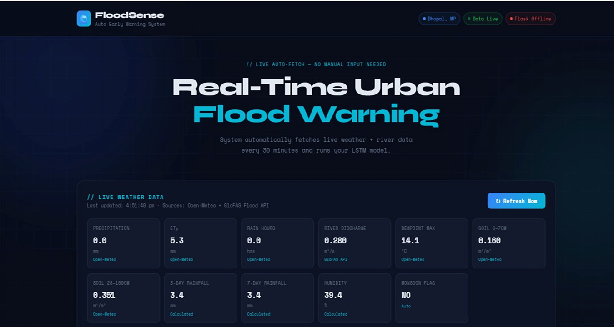
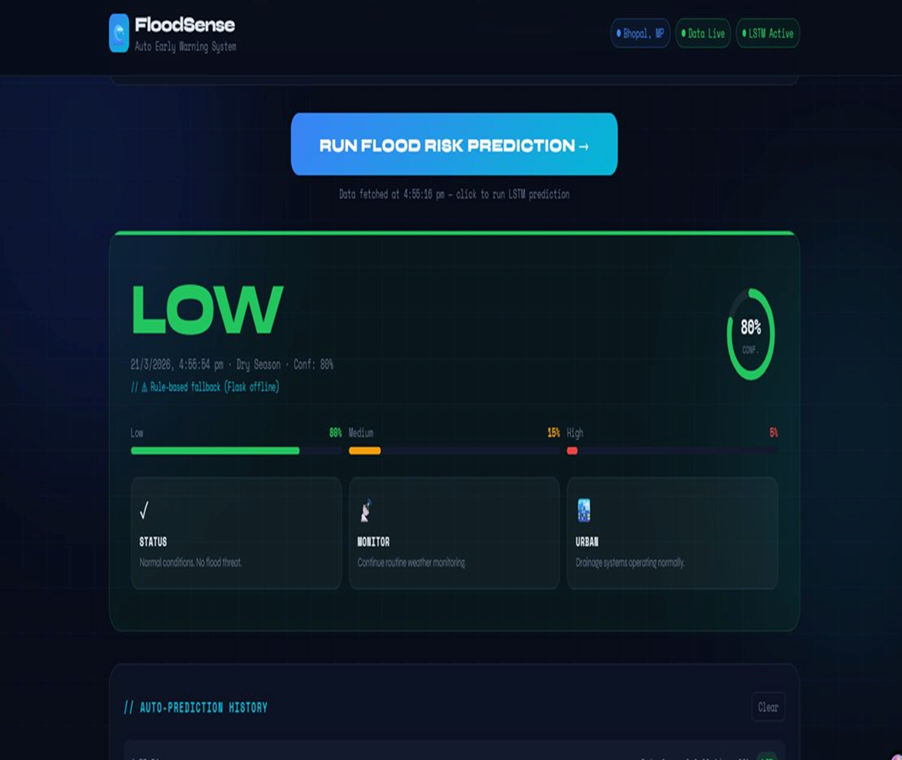

# FloodSense — Urban Flood Early Warning System

> AI-powered real-time flood risk prediction using LSTM deep learning. No manual input required — the system automatically fetches live weather and hydrological data and predicts flood risk level (Low / Medium / High) for any location.

---

## Table of Contents

- [Overview](#overview)
- [Features](#features)
- [Tech Stack](#tech-stack)
- [Project Structure](#project-structure)
- [Dataset](#dataset)
- [Model Architecture](#model-architecture)
- [Installation](#installation)
- [Usage](#usage)
- [API Reference](#api-reference)
- [Screenshots](#screenshots)
- [Future Scope](#future-scope)

---

## Overview

Urban flooding causes billions in damage and hundreds of deaths annually across Indian cities. Most existing systems rely on manual gauge readings and fragmented data — alerts arrive too late.

**FloodSense (UFEWS)** solves this by:

- Automatically fetching the **last 5 days** of weather + river data from free APIs
- Running it through a trained **LSTM model** to classify flood risk
- Delivering predictions via a **Flask REST API** and live **web dashboard**
- Requiring **zero manual input** from the user

Trained on **14 years of historical data** (2010–2026) from Bhopal, India.

---

## Features

- **Auto data fetch** — Open-Meteo + GloFAS APIs, no login or download needed
- **11 engineered features** — rainfall, soil moisture, river discharge, humidity, monsoon flag, and more
- **Sequence gap filling** — automatically bridges the gap between training cutoff and today
- **LSTM classification** — Low / Medium / High flood risk with confidence score
- **Live dashboard** — color-coded risk display, probability bars, emergency guidance
- **Auto-refresh** — dashboard refetches data every 30 minutes
- **Location-aware** — uses lat/lon to fetch city-specific data

---

## Tech Stack

| Layer | Technology |
|---|---|
| Deep Learning | TensorFlow / Keras (LSTM) |
| Data Processing | Python, Pandas, NumPy |
| Backend API | Flask, Flask-CORS |
| Model Persistence | Joblib (scaler), H5 (model) |
| Weather Data | Open-Meteo Archive API |
| River Data | GloFAS Flood API (Open-Meteo) |
| Soil Moisture | Open-Meteo Hourly API |
| Frontend | HTML, CSS, JavaScript |
| Scaling | Scikit-learn StandardScaler |

---

## Project Structure

```
flood-early-warning-system/
│
├── app.py                        # Flask API backend
├── flood_lstm_model.h5           # Trained LSTM model
├── scaler.pkl                    # Fitted StandardScaler
│
├── data_collection/
│   ├── rainfall_data.csv         # Precipitation + weather (Open-Meteo)
│   ├── river_discharge_data.csv  # River discharge (GloFAS)
│   ├── soil_moisture_data.csv    # Soil moisture (Open-Meteo Hourly)
│   ├── weather_data.csv          # Temperature, dewpoint, wind, ET0
│   └── flood_final_dataset.csv   # Merged + engineered final dataset
│
├── notebooks/
│   └── model_training.ipynb      # Data collection, EDA, LSTM training
│
├── flood_warning_dashboard.html   # Live web dashboard
│     
│
└── README.md
```

---

## Dataset

All data was collected from **free, open APIs** — no registration required for most sources.

| Feature | Source | Frequency |
|---|---|---|
| `precipitation_sum` | Open-Meteo Archive | Daily |
| `et0_fao_evapotranspiration` | Open-Meteo Archive | Daily |
| `precipitation_hours` | Open-Meteo Archive | Daily |
| `dewpoint_2m_max` | Open-Meteo Archive | Daily |
| `river_discharge` | GloFAS / Open-Meteo Flood API | Daily |
| `soil_moisture_0_to_7cm` | Open-Meteo Hourly → Daily avg | Hourly |
| `soil_moisture_28_to_100cm` | Open-Meteo Hourly → Daily avg | Hourly |
| `rainfall_3d` | Derived (3-day rolling sum) | — |
| `rainfall_7d` | Derived (7-day rolling sum) | — |
| `humidity` | Derived from dewpoint | — |
| `is_monsoon` | Derived (June–September = 1) | — |

**Training period:** 2010-01-01 to 2026-02-18
**Total rows:** 5,864
**Location:** Bhopal, Madhya Pradesh (lat: 23.2599, lon: 77.4126)

---

## Model Architecture

```
Input: (batch, 5, 11)   ← 5-day sequence, 11 features

LSTM(64, return_sequences=True)
Dropout(0.2)
LSTM(32)
Dropout(0.2)
Dense(3, activation='softmax')

Output: [P(Low), P(Medium), P(High)]
```

**Training details:**

- Loss: `sparse_categorical_crossentropy`
- Optimizer: `Adam`
- Early stopping: patience = 5 on `val_loss`
- Train/Test split: 80/20 (no shuffle — time series)
- Scaler: `StandardScaler` fitted on training set only

**Flood risk labels** were generated using a threshold-based rule function combining `precipitation_sum`, `rainfall_3d`, `river_discharge`, and `soil_saturation`.

---

## Installation

**1. Clone the repository**

```bash
git clone https://github.com/Prakhar-garg12/Urban-Flood-Early-Warning-System
cd flood-early-warning-system
```

**2. Install dependencies**

```bash
pip install flask flask-cors tensorflow joblib numpy pandas requests scikit-learn
```

**3. Make sure model files exist**

```
flood_lstm_model.h5   ← trained model
scaler.pkl            ← fitted scaler
```

If you want to retrain, run the notebook in `notebooks/model_training.ipynb`.

---

## Usage

**Start the Flask API:**

```bash
python app.py
```

You should see:

```
Loading LSTM model...
Model loaded successfully!
 * Running on http://127.0.0.1:5000
```

**Open the dashboard:**

Open `frontend/flood_warning_dashboard.html` in your browser. The dashboard will:

1. Detect your location (or use Bhopal as default)
2. Fetch the last 5 days of live data from APIs
3. Call the Flask API for LSTM prediction
4. Display flood risk level with confidence score

---

## API Reference

### `GET /health`

Check if model is loaded and API is running.

```json
{
  "status": "ok",
  "sequence": 5,
  "features": 11
}
```

---

### `POST /predict`

Run flood risk prediction for a given location.

**Request body:**

```json
{
  "user_lat": 23.2599,
  "user_lon": 77.4126
}
```

**Response:**

```json
{
  "success": true,
  "risk_class": 0,
  "risk_label": "Low",
  "confidence": 0.84,
  "probabilities": {
    "Low": 0.84,
    "Medium": 0.13,
    "High": 0.03
  },
  "sequence_used": ["16-Mar-2026", "17-Mar-2026", "18-Mar-2026", "19-Mar-2026", "20-Mar-2026"],
  "live_values": {
    "precipitation_sum": 0.0,
    "river_discharge": 0.28,
    "rainfall_3d": 3.4,
    "rainfall_7d": 3.4,
    "humidity": 39.4,
    "soil_moisture_0_to_7cm": 0.16,
    "is_monsoon": 0
  }
}
```

**Risk classes:**

| Class | Label | Action |
|---|---|---|
| 0 | Low | Normal monitoring |
| 1 | Medium | Alert residents, check drains |
| 2 | High | Activate emergency protocols |

---

## Screenshots

### Live Weather Dashboard


### Flood Risk Prediction


---

## Future Scope

- **Multi-city support** — train separate models for Mumbai, Delhi, Chennai
- **SMS / WhatsApp alerts** — Twilio integration for High risk notifications
- **24–48 hour forecast** — use Open-Meteo forecast API instead of archive
- **Flood extent mapping** — geographic visualization of affected zones
- **Mobile app** — React Native wrapper for the dashboard

---

## Acknowledgements

- [Open-Meteo](https://open-meteo.com) — free weather archive and forecast API
- [GloFAS](https://globalfloods.eu) — global flood awareness system river discharge data
- [TensorFlow / Keras](https://tensorflow.org) — deep learning framework
- Mosavi et al. (2018) — LSTM for flood prediction research

---

## License

This project is open source and available under the [MIT License](LICENSE).
